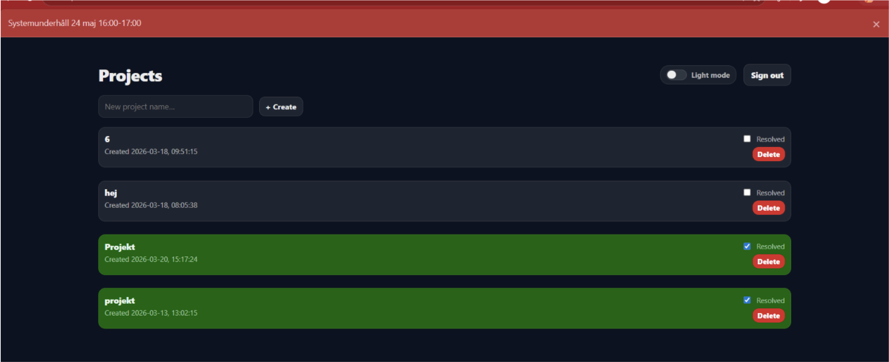
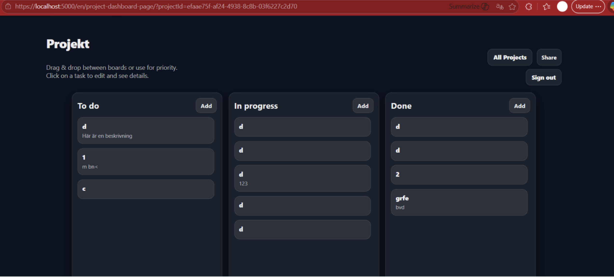

# Secure Project Management Dashboard

A secure project and task management platform built with Optimizely CMS, ASP.NET Core, React and a separate .NET REST API.

The application allows authenticated users to manage projects, tasks and project memberships through an administrative dashboard. The project was developed as part of a Bachelor's Thesis in Computer Engineering at Chalmers University of Technology, in collaboration with Precio Fishbone.

The work focused on creating a secure, usable and structured system for administrative users, with particular attention to authentication, authorization, API communication, access control and testing.

---

## Overview

The platform supports administrative workflows for managing projects and tasks. Users can create and manage projects, assign members, create tasks and control access based on roles and project membership.

The project demonstrates experience in:

* Building administrative systems for users and organisations
* Designing role-based and project-specific access control
* Working with SQL databases and data persistence
* Integrating frontend, CMS and backend API components
* Testing and validating web-based systems
* Applying security controls to protect users, data and administrative resources
* Structuring technical solutions with both usability and security in mind

---

## Key Features

### Project Management

* Create, edit and delete projects
* Manage project members
* Apply project-specific authorization
* View projects through an administrative dashboard

### Task Management

* Create, update and remove tasks
* Assign tasks to project members
* Restrict task visibility based on project membership
* Receive real-time updates through SignalR

### Optimizely CMS Integration

* Content management through Optimizely CMS
* Role-based access control for CMS editors and administrators
* React frontend integrated into Optimizely Razor views

---

## Architecture

```text
Browser
  ↓
Optimizely CMS (.NET 8 + React)
  ↓
Server-side Proxy
  ↓
Backend REST API (.NET)
  ↓
SQL Server
```

The architecture separates presentation, authentication, authorization, business logic and persistence into distinct layers.

This separation helps keep responsibilities clear between the user interface, CMS integration, security controls, backend functionality and database storage.

---

## Security Features

Security was a central part of the project. The solution applies multiple layers of protection to reduce the risk of unauthorised access and insecure API communication.

### Authentication and Authorization

* ASP.NET Core Identity authentication
* Role-Based Access Control (RBAC)
* Protected administrative resources using `[Authorize]`
* Project membership verification
* Secure logout with server-side session invalidation
* HTTP 401 responses for unauthenticated requests
* HTTP 403 responses for unauthorised requests

### API Security

* API key authentication
* Constant-time API key comparison using `CryptographicOperations.FixedTimeEquals`
* Server-side proxy to prevent client-side API key exposure
* User-context forwarding between the web application and backend API
* Project membership verification before access to project-specific data

### Additional Security Controls

* Input validation using FluentValidation
* IP-based rate limiting
* Audit logging of security-sensitive operations
* CORS restrictions
* Content Security Policy with nonce support
* HTTPS communication

---

## Technology Stack

### Frontend

* React
* TypeScript
* Vite
* Razor Views

### Backend

* ASP.NET Core
* .NET REST API
* SignalR
* FluentValidation

### CMS

* Optimizely CMS

### Database

* SQL Server
* Entity Framework Core

### Security

* ASP.NET Core Identity
* Role-Based Access Control
* API Key Authentication
* Rate Limiting
* Audit Logging
* CORS
* Content Security Policy
* HTTPS

### Development and Testing Tools

* Git
* Browser DevTools
* Fiddler
* Terminal-based HTTP requests

---

## Testing

The application was tested using a combination of manual and technical testing methods.

Testing activities included:

* Testing authentication and logout flows
* Verifying role-based access control
* Verifying project membership restrictions
* Testing API requests and responses
* Testing input validation
* Inspecting browser requests through DevTools
* Performing terminal-based HTTP requests
* Using Fiddler to inspect network communication
* Verifying that API keys were not exposed to the client

---

## What I Built

This project was developed as part of my Bachelor's Thesis in Computer Engineering at Chalmers University of Technology.

My work focused on designing and implementing:

* A project and task management dashboard for administrative users
* Secure communication between a web application and a backend API
* Role-based access control in Optimizely CMS
* Project-specific authorization based on user membership
* A layered authorization model across the frontend, CMS, proxy and API
* Secure session handling and logout functionality
* API protection through server-side proxying and API key validation
* Input validation, audit logging, rate limiting and browser security policies
* Testing of authorization flows, API behaviour and security-related scenarios

The project combined technical development with analysis of user access, system behaviour and security requirements.

---

## Project Goals

The main goals of the project were to:

* Build a usable dashboard for project and task administration
* Ensure that users could only access information relevant to their role and project membership
* Protect API communication and sensitive credentials
* Apply defence-in-depth security principles
* Create a structured solution that separates responsibilities across system layers
* Combine security requirements with practical usability for administrative users

---

## Author

Nuha Alshami
Bachelor's Thesis in Computer Engineering
Chalmers University of Technology
Developed in collaboration with Precio Fishbone
